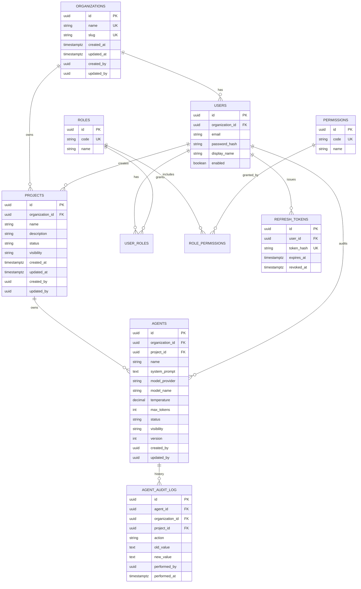

# Database ER — Auth, Organizations, Projects

```mermaid
erDiagram
  ORGANIZATIONS ||--o{ USERS : has
  ORGANIZATIONS ||--o{ PROJECTS : owns
  USERS ||--o{ USER_ROLES : has
  ROLES ||--o{ USER_ROLES : grants
  ROLES ||--o{ ROLE_PERMISSIONS : includes
  PERMISSIONS ||--o{ ROLE_PERMISSIONS : granted_by
  USERS ||--o{ REFRESH_TOKENS : issues
  USERS ||--o{ PROJECTS : creates

  ORGANIZATIONS {
    uuid id PK
    string name UK
    string slug UK
    timestamptz created_at
    timestamptz updated_at
    uuid created_by
    uuid updated_by
  }

  USERS {
    uuid id PK
    uuid organization_id FK
    string email
    string password_hash
    string display_name
    boolean enabled
  }

  ROLES {
    uuid id PK
    string code UK
    string name
  }

  PERMISSIONS {
    uuid id PK
    string code UK
    string name
  }

  PROJECTS ||--o{ AGENTS : owns
  USERS ||--o{ AGENTS : audits
  AGENTS ||--o{ AGENT_AUDIT_LOG : history

  PROJECTS {
    uuid id PK
    uuid organization_id FK
    string name
    string description
    string status
    string visibility
    timestamptz created_at
    timestamptz updated_at
    uuid created_by
    uuid updated_by
  }

  AGENTS {
    uuid id PK
    uuid organization_id FK
    uuid project_id FK
    string name
    text system_prompt
    string model_provider
    string model_name
    decimal temperature
    int max_tokens
    string status
    string visibility
    int version
    uuid created_by
    uuid updated_by
  }

  AGENT_AUDIT_LOG {
    uuid id PK
    uuid agent_id FK
    uuid organization_id FK
    uuid project_id FK
    string action
    text old_value
    text new_value
    uuid performed_by
    timestamptz performed_at
  }

  REFRESH_TOKENS {
    uuid id PK
    uuid user_id FK
    string token_hash UK
    timestamptz expires_at
    timestamptz revoked_at
  }
```

Unique constraints:

- `organizations.name`, `organizations.slug`
- `projects (organization_id, name)`
- `agents (project_id, name)`
