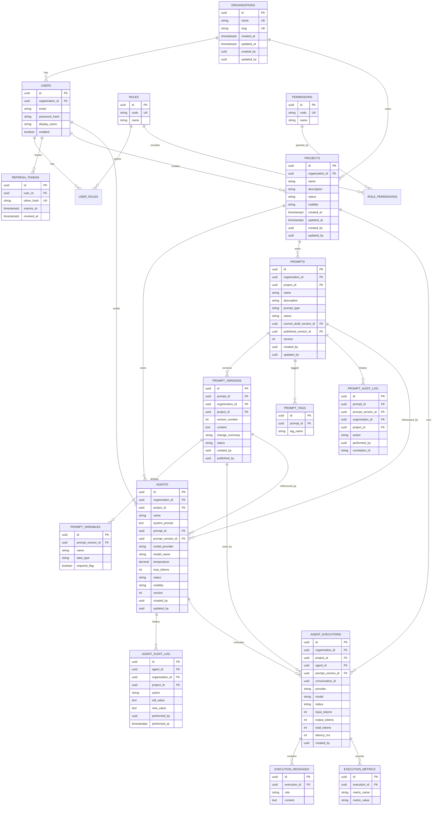

# Database ER — Auth, Organizations, Projects, Agents, Prompts

Unique constraints:

- `organizations.name`, `organizations.slug`
- `projects (organization_id, name)`
- `agents (project_id, name)`
- `prompts (project_id, name)`
- `prompt_versions (prompt_id, version_number)`
- `prompt_variables (prompt_version_id, name)`
- `prompt_tags (prompt_id, tag_name)`
- `execution_metrics (execution_id, metric_name)`
