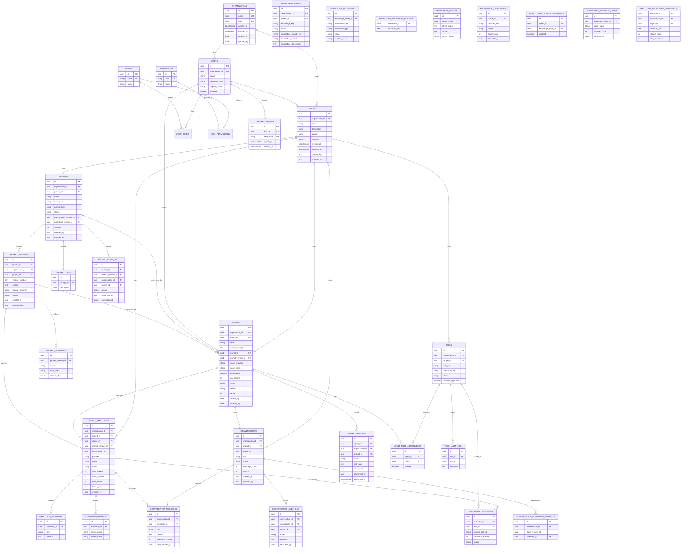

# Database ER — Auth, Organizations, Projects, Agents, Prompts

Unique constraints:

- `organizations.name`, `organizations.slug`
- `projects (organization_id, name)`
- `agents (project_id, name)`
- `prompts (project_id, name)`
- `prompt_versions (prompt_id, version_number)`
- `prompt_variables (prompt_version_id, name)`
- `prompt_tags (prompt_id, tag_name)`
- `execution_metrics (execution_id, metric_name)`
- `conversation_messages (conversation_id, sequence_number)`
- `conversation_execution_requests (conversation_id, client_request_id)`
- `tools (organization_id, project_id, tool_key)`
- `agent_tool_assignments (agent_id, tool_id)`
- `execution_tool_calls (execution_id, runtime_call_id)`
- `execution_tool_calls (execution_id, sequence_number)`
- `knowledge_bases (project_id, knowledge_key)`
- `knowledge_documents (knowledge_base_id, document_key)`
- `knowledge_chunks (document_id, chunk_index)`
- `knowledge_embeddings (chunk_id, provider_key, model)`
- `agent_knowledge_assignments (agent_id, knowledge_base_id)`

Migrations: `V16__knowledge_base.sql`, `V17__knowledge_embeddings.sql`, `V18__knowledge_permissions_seed.sql`.
See [`018_KNOWLEDGE_BASE_AND_RAG.md`](018_KNOWLEDGE_BASE_AND_RAG.md).
